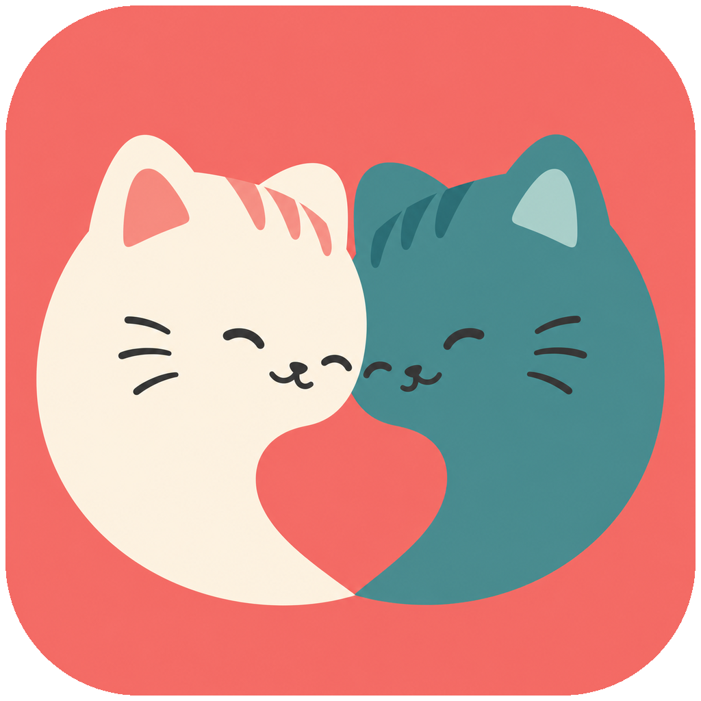

# 彼端桌宠



彼端桌宠是一款为异地情侣设计的 Windows 桌面陪伴应用。它把两个人的状态、轻互动和留言放到桌面上，让陪伴不必总以打开聊天软件开始。

当前版本为 **0.4.2 MVP**。桌宠会按照“我的状态”或“TA 的状态”播放对应 GIF；用户可以拖动角色、切换动作来源、发送轻互动、记录纪念日和留言，并通过两个人共用的云盘文件夹同步数据。

> 当前版本已经可以安装和试用，但仍属于早期 MVP。它没有官方云服务器、账号系统、实时绑定和商业代码签名，不应被理解为正式商用版本。

## 产品想解决什么

- **低打扰地陪伴**：桌宠常驻桌面，不需要频繁打开聊天窗口。
- **一眼理解状态**：工作、吃饭、睡觉、开心等状态直接表现为角色动作。
- **保留两个人的小事**：留言、互动、纪念日和陪伴值都保存在本机。
- **给联网版验证方向**：先用共享文件夹完成双机试用，再决定账号、云同步和情侣空间如何落地。

## 当前已经实现

- 透明、置顶、可拖动的 Windows 桌宠，支持右键菜单和系统托盘。
- 11 类状态、共 61 个状态 GIF（其中 3 个可用于开机招呼），另有 1 个拖拽专用动作。
- 同类动作可按 10 秒、30 秒、60 秒或 5 分钟轮换，默认 60 秒。
- 可选择桌面表现“我的状态”或“TA 的状态”，该选择仅影响本机。
- 轻轻碰你、抱抱、喂糖、休息等温柔互动。
- 心情、能量、想念三个陪伴值。
- 在一起天数、纪念日倒计时和留言信箱。
- 共享文件夹自动同步，以及手动导出/导入同步文件。
- 软件图标、托盘图标、开机启动、中文安装和卸载程序。
- 本地 JSON 持久化，升级和卸载不会主动删除情侣资料。

完整功能与现有限制见 [当前功能说明](docs/FEATURES.md)。后续版本规划见 [产品路线图](docs/ROADMAP.md)。

## 快速使用

### 安装版

发布安装包不会提交到源码仓库。开发者可在本地执行：

```powershell
.\build_release.ps1
```

构建完成后，安装包位于 `release\BiDuan_Setup_0.4.2.exe`。

### 从源码运行

环境要求：Windows 10/11、Python 3.12、Git LFS。

```powershell
git lfs install
py -3.12 -m venv .venv
.\.venv\Scripts\python.exe -m pip install -r requirements.txt
.\.venv\Scripts\python.exe .\src\biduan_pet.py
```

第一次运行时，双击桌宠打开“情侣小窝”，填写昵称和纪念日。在“动作”页选择桌面显示自己还是 TA 的状态；需要双机同步时，在“互动”页让双方选择同一个云盘共享文件夹。

## 数据与隐私

当前版本不要求注册账号，也不会把数据上传到彼端自己的服务器。用户数据默认保存在：

```text
%APPDATA%\BiDuanPet
```

启用自动同步后，程序只在用户选择的共享目录中读写彼端同步 JSON。共享目录的上传和传输由 OneDrive、坚果云等第三方云盘完成。

## 项目结构

```text
assets/                 品牌图标和 GIF 动作资源
docs/                   功能、路线图、开发和产品文档
installer/              Inno Setup 安装脚本和版本信息
src/biduan_pet.py       桌宠主程序
tests/test_core.py      状态、同步和动画资源测试
tools/                  图标与动画资源导入工具
build_exe.ps1           构建独立 EXE
build_release.ps1       构建 EXE 和 Windows 安装包
```

## 开发与构建

- [当前功能说明](docs/FEATURES.md)
- [后续产品路线图](docs/ROADMAP.md)
- [源码开发指南](docs/DEVELOPMENT.md)
- [完整产品计划](docs/product_plan.md)

运行测试：

```powershell
.\.venv\Scripts\python.exe -m unittest discover -s .\tests -v
```

当前测试覆盖状态迁移、双机同步、动作清单、GIF 帧加载、透明边缘处理和桌面状态来源等核心逻辑。

## 素材与授权

本仓库目前未声明开源许可证。公开可见仅用于展示和协作，不代表源码或 GIF 素材自动获得复制、商用或再分发授权。GIF 动作资源由项目所有者提供，其他用途需单独确认权利，详见 [动画素材说明](assets/animations/README.md)。
